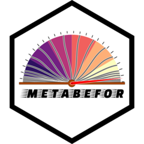

<!-- README.md is generated from README.Rmd. Please edit that file -->

#  metabefor 📦

## Modular, Extensible, Transparent, Accessible, Bootstrapped Extraction For Systematic Reviews

<!-- badges: start -->

[](https://cran.r-project.org/package=metabefor)

[](https://CRAN.R-project.org/package=metabefor)

[](https://gitlab.com/r-packages/metabefor/-/commits/main)

[](https://cran.r-project.org/package=metabefor)

[](https://cran.r-project.org/package=metabefor)

<!-- [](https://app.codecov.io/gl/r-packages/metabefor?branch=main) -->
<!-- badges: end -->

The pkgdown website for this project is located at
<https://r-packages.gitlab.io/metabefor>.

<!--------------------------------------------->
<!-- Start of a custom bit for every package -->
<!--------------------------------------------->

In systematic reviews, extracting data from primary sources is a crucial
step with a high potential for introduction of biases. This package
facilitates specification of R extraction scripts that are
simultaneously human- and machine-readable. In addition, they are
modular and extensible, lending themselves well to living reviews where
insights as to optimal extraction evolve over time. By being R Markdown
script files, they are optimally transparant, and their structure was
designed to also be accessible to readers without R. Finally, each
extraction script contains the original specification, enabling
bootstrapping new specifications from each single extraction script.

Originally, the package was intended to help with everything that needs
to be done before the [metafor](https://metafor-project.org) package can
be used, hence the name. Since then, the
[metaverse](https://rmetaverse.github.io/) was born, with dedicated
packages for specific stages, such as developing search strategies,
working with bibliographic data, and visualisation. Presently,
therefore, `metabefor` mostly covers extraction.

## Getting started

Eventually, the best place to get started will be the
[SysRevving](https://sysrevving.com) book. However, as yet that is still
very much in its early stages. For now, the following pages form a good
starting point:

1.  The [Planning](https://sysrevving.com/planning) chapter in the
    SysRevving book (in progress)
2.  The [Extraction](https://sysrevving.com/extraction) chapter in the
    SysRevving book (in progress)
3.  The [R Extraction
    Scripts](http://r-packages.gitlab.io/metabefor/articles/r-extraction-scripts.html)
    vignette (in progress)
4.  The
    [Definitions](http://r-packages.gitlab.io/metabefor/articles/definitions.html)
    vignette (in progress)

<!--------------------------------------------->
<!--  End of a custom bit for every package  -->
<!--------------------------------------------->

## Installation

You can install the released version of `metabefor` from
[CRAN](https://CRAN.R-project.org) with:

``` r
install.packages('metabefor');
```

You can install the development version of `metabefor` from
[GitLab](https://about.gitlab.com) with:

``` r
remotes::install_gitlab('r-packages/metabefor@main');
```

(assuming you have `remotes` installed; otherwise, install that first
using the `install.packages` function)

<!-- You can install the cutting edge development version (own risk, don't try this at home, etc)  of `metabefor` from [GitLab](https://about.gitlab.com) with: -->
<!--------------------------------------------->
<!-- Start of a custom bit for every package -->
<!--------------------------------------------->

## Other useful resources

For an extensive resource about effect size computation and conversion,
see <https://mgto.org/effectsizepowerguide>.

<!--------------------------------------------->
<!--  End of a custom bit for every package  -->
<!--------------------------------------------->
